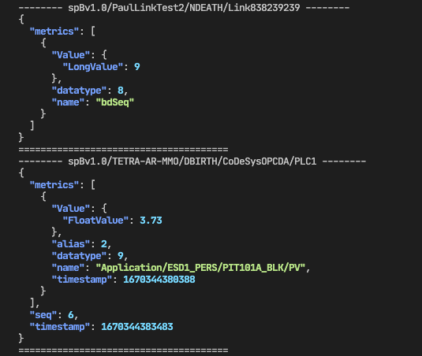

# MQTT Sparkplug Lens

MQTT Sparkplug Lens is a tiny command line utility that dumps all the Sparkplug messages in colored JSON format. This tool makes it easy to view and analyze MQTT Sparkplug messages in a human-readable format.

## Usage

Before using the tool, you need to set the environment variable MQTT_BROKER in the following [format](https://pkg.go.dev/github.com/eclipse/paho.mqtt.golang#ClientOptions.AddBroker):

```sh
MQTT_BROKER=tcp://test.mosquitto.org:1883
```

You can replace the value with your broker's URL. Currently, the tool only supports MQTT brokers without any authentication. You can run the tool using the following command:

```sh
MQTT_BROKER=tcp://test.mosquitto.org:1883 ./sparkplug-lens
```

## Screenshot



## TODO

- [ ] Add support for TLS and username/password authentication.
- [ ] Support GroupID / NodeID Filter.

## License

MIT
